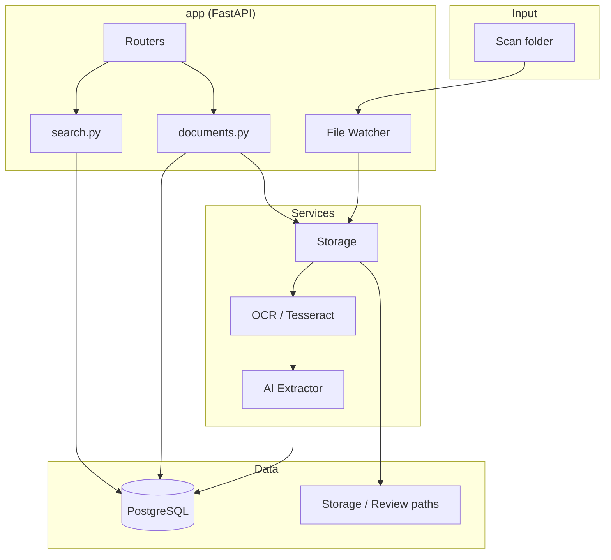

# Architecture

High-level design of the Related Education Document Server.

## System Overview

## Main Modules / Layers

| Layer | Location | Responsibility |
|-------|----------|----------------|
| **Web / API** | `app/main.py`, `app/routers/` | HTTP routes, HTML pages, lifespan (start file watcher, init DB). |
| **Routers** | `app/routers/documents.py`, `app/routers/search.py` | Document CRUD, upload, review queue, search, autocomplete (students/courses/assignments). |
| **Models & Schemas** | `app/models.py`, `app/schemas.py` | SQLAlchemy `Document` model; Pydantic request/response and list schemas. |
| **Services** | `app/services/` | Storage (optimize, store, move review/final), OCR (Tesseract), AI extraction (OpenAI), file watcher (watchdog). |
| **Config** | `app/config.py` | Env-based settings: DB URL, paths (scan, processed, review, storage), OpenAI key, image/PDF options. |
| **Database** | `app/database.py` | Session factory, `get_db`, `init_db` (create tables). |

## Data Flow

1. **New document (watch folder)**  
   File appears in `SCAN_FOLDER_PATH` → File Watcher detects → `process_document()`: Storage stores/optimizes (UUID name) → OCR extracts text → AI extracts fields (+ student_id; document_type from OCR “Certificate issued”) → review status computed → file moved to review/final → **rename to descriptive name** (StudentName_CourseName_Type_Last4.ext) → record in DB → original moved to `_processed` or `_review_queue`.

2. **Manual upload**  
   `POST /api/documents/upload/manual` (optional form field `document_type`) → same `process_document()` pipeline; type from form or OCR; file from multipart upload (temp file).

3. **Review flow**  
   Documents with missing fields or low confidence get `requires_review=True` and are stored under review paths. User corrects via `POST /api/documents/{id}` → `refresh_review_status()` → if no longer needs review, file is moved to final storage and original is removed from `_review_queue`.

4. **Search**  
   `GET /api/search` (and optional filters) → SQL filters on `Document` (student, course, assignment, **student_id**, date range, full-text across fields, student_id, and OCR) → paginated list.

## Design Decisions

- **Review vs final storage**: Documents needing review live in a separate path and queue; once all required fields are set and saved, they move to final storage and the scan-folder copy is deleted.
- **Single process**: File watcher runs in the same process as FastAPI; no separate worker. Good for single-node deployment.
- **Paths**: All scan/storage paths are resolved to absolute in config so watcher and move logic behave consistently across working directories.
- **Document ID**: UUID from storage at store time (or new UUID if parse fails); used for DB primary key. Stored **filename** is then renamed to a descriptive value (StudentName_CourseName_poe|certificate_Last4.ext) for easier identification on disk; collisions get suffix _1, _2, etc.
- **Document type**: Allowed values `poe`, `certificate`. Set from upload form (manual) or from OCR text (“Certificate issued” → certificate). Default `poe`.
- **Student ID**: Optional 13-digit ID; extracted by AI and regex fallback (`\b\d{13}\b`); indexed and searchable.
