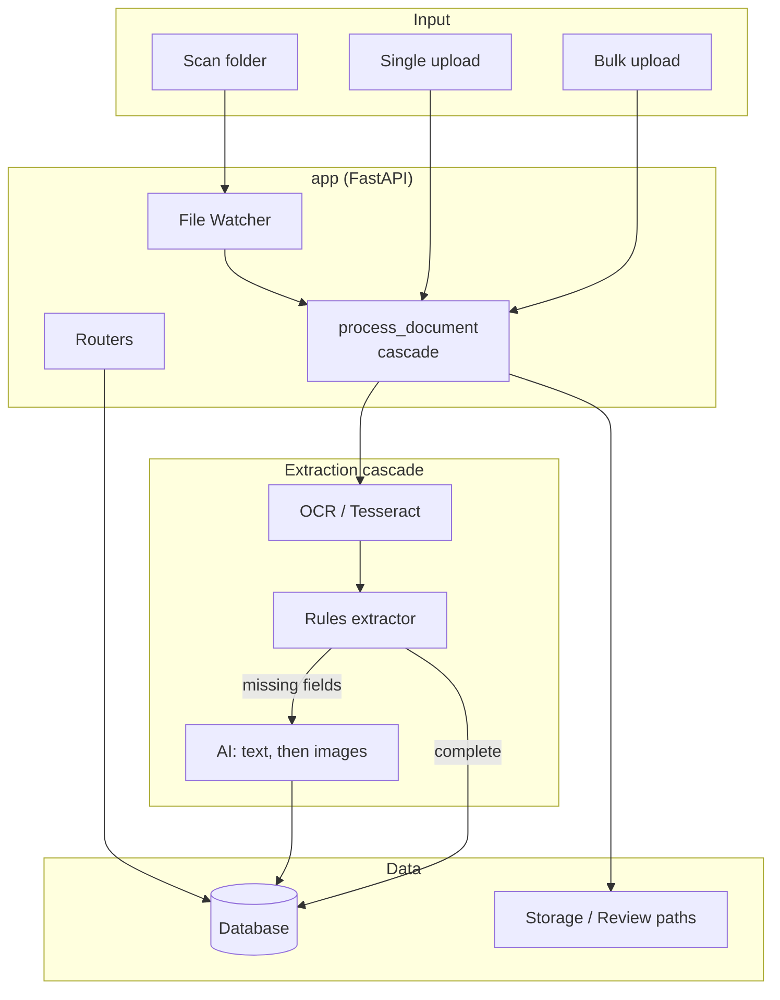
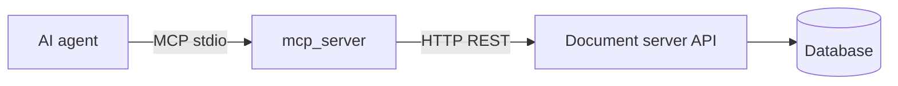

# Architecture

High-level design of the Related Document Server.

## System Overview

A FastAPI application that ingests scanned documents (via a watched folder,
single upload, or bulk upload), extracts structured fields through a tiered
**extraction cascade**, and exposes a searchable web UI + REST API. Document
types and their fields are **configuration, not code**, and the AI provider is
runtime-configurable.

## The extraction cascade

`process_document()` (in `app/routers/documents.py`) is the heart of the
system. It is deliberately **rules-first / minimal-AI**: the AI tier only runs
when deterministic extraction can't fill every required field.

1. **Store** — optimize + store the file (UUID name), generate PDF previews.
2. **Identify** — document type from the upload form, or auto-identified from
   a cheap one-page OCR: per-type filename patterns and detection keywords
   (`document_type_service.detect_type`), then an optional text-only AI
   classification call, then the default. The type determines
   the field set and the page cap.
3. **OCR** — Tesseract reads up to the type's `max_pages` (Certificate 1,
   POE 5). Page caps limit cost and how much of a document is processed
   (a POPIA data-minimization measure).
4. **Rules** — `rules_extractor` deterministically pulls fields from the OCR
   text: SA ID (13-digit + Luhn checksum), label-preferred dates, and
   label-anchored named fields.
5. **Gate 1** — if all *required* fields for the type are present, done.
   Otherwise escalate.
6. **AI** — `ai_extractor` sends the OCR text first (cheap); only if required
   fields are still missing (and the type allows it) it renders the first `max_pages` page images
   and asks the configured multimodal model for *only that type's* fields
   (reading images directly handles handwriting). Rules-validated values win;
   AI fills the gaps.
7. **Validate** — the ID is re-checked with the checksum; an invalid AI/OCR ID
   is discarded rather than trusted.
8. **Gate 2** — still-missing required fields, low AI confidence, or an AI
   error route the document to the **review queue**; otherwise it is approved.
9. **Persist** — move to final/review storage, rename to a descriptive name,
   save core fields to columns and custom fields to the typed value store.

## Main Modules / Layers

| Layer | Location | Responsibility |
|-------|----------|----------------|
| **Web / API** | `app/main.py`, `app/routers/` | HTTP routes, HTML pages, lifespan (init DB, seed types, start watcher). |
| **Documents** | `app/routers/documents.py` | CRUD, single + streaming bulk upload, the `process_document` cascade, review logic. |
| **Search** | `app/routers/search.py` | Full-text search (incl. custom field values) + student/course/assignment autocomplete. |
| **Document types** | `app/routers/document_types.py`, `app/services/document_types.py` | Configurable types & fields (CRUD), field registry, seeding, per-type `max_pages`. |
| **Settings** | `app/routers/settings.py`, `app/services/settings.py` | Runtime AI config (provider/model/key/base URL), cost guards (daily call limit, text/image caps), per-day usage metering, connection test; stored in `app_settings`. |
| **Extraction** | `app/services/rules_extractor.py`, `ai_extractor.py`, `llm.py` | Deterministic rules; one type-driven AI extractor (text tier, image tier, classification, budget guard); provider layer (OpenAI-compatible incl. xAI/Azure/local, and Anthropic via its SDK). |
| **Storage / OCR** | `app/services/storage.py`, `ocr_service.py` | Optimize/store/move files & previews; page-capped OCR. |
| **Field values** | `app/services/field_values.py` | Typed read/write of custom field values. |
| **Watcher** | `app/services/file_watcher.py` | Watch the scan folder; hand new files to the cascade. |
| **Models & Schemas** | `app/models.py`, `app/schemas.py` | SQLAlchemy models; Pydantic request/response schemas. |
| **Config / DB** | `app/config.py`, `app/database.py` | Env settings, external-tool paths; engine, sessions, `init_db` migrations. |

## Data Model

All tables are additive; existing document data is never rewritten.

- **documents** — one row per document. Core fields in columns (student_name,
  course_name, assignment_name, grade, document_date, document_type,
  student_id) plus processing metadata (ocr_text, extraction_confidence,
  **ai_used**, **extraction_error**, requires_review, review_reason).
- **document_types** — configurable types: `key`, `label`, `sort_order`,
  `is_active`, `max_pages`, and a JSON `fields` list (each field: key,
  required, visible, and — for custom fields — label + data_type).
- **document_field_values** — typed values for *custom* fields, one row per
  (document, field). `value_text` is always set (uniform text search);
  `value_number` / `value_date` are set for typed queries. Keeps the
  `documents` table stable while every field stays searchable.
- **app_settings** — key/value runtime settings (AI provider, model, API key,
  base URL, enabled).

## Field model

Every field has a `data_type` (`text` / `number` / `date` / `id`) and a
`source`:

- **core** — maps 1:1 to a `documents` column (the registry in
  `app.services.document_types.CORE_FIELDS`).
- **custom** — defined per type on the Settings page; stored in
  `document_field_values`.

This field config is the single source of truth the review form, search, and
the MCP server all read from — `list_document_types` exposes it to agents.

## MCP server

`mcp_server/` is a separate **stdio MCP server** that lets AI agents use the
document server. It is a thin HTTP client over the REST API (no direct DB
access), so it inherits the same review/validation rules. The target server is
set with `RDS_BASE_URL` (default: the live server). It exposes 12 tools across
search/read, upload (single + bulk), review-queue correction, and schema/AI
diagnostics — read + add + edit only (no delete; AI config read-only). See
[../mcp_server/README.md](../mcp_server/README.md).

## Data Flow

1. **New document** — scan folder / single upload / bulk upload → cascade →
   move to final or review storage → descriptive rename → DB record (+ custom
   values). Bulk upload processes files one at a time and streams stage events.

2. **Review flow** — documents missing required fields, with low AI confidence,
   or an AI error get `requires_review=True` and live in review storage. A user
   corrects fields via `POST /api/documents/{id}` → review status recomputes →
   once complete, the file moves to final storage.

3. **Search** — SQL filters across core columns, OCR text, and custom field
   values (join on `document_field_values`).

## Design Decisions

- **Rules-first, minimal AI** — deterministic extraction handles clean printed
  documents for free; the vision model is a fallback for handwriting / varied
  layouts, minimizing cost and PII sent externally.
- **Per-type page caps** — cap OCR and AI to the pages that matter (Certificate
  1, POE 5), bounding cost and data exposure.
- **ID is validated, never trusted** — SA IDs are checked with a Luhn checksum
  regardless of whether rules or AI produced them.
- **Types & fields as data** — new types and custom fields are added on the
  Settings page, not in code; custom values are typed and searchable.
- **AI config at runtime** — provider/model/key/base URL live in the DB and are
  editable in the UI (Base URL supports local/self-hosted, on-prem for POPIA).
- **Failures are visible** — AI errors are recorded and surfaced in the review
  queue, never silently swallowed.
- **Additive DB changes** — new columns/tables only; SQLite self-heals columns,
  Postgres uses `ADD COLUMN IF NOT EXISTS`.
- **Single process** — watcher, bulk worker, and HTTP server share one process;
  bulk work is serialized to protect the server.
